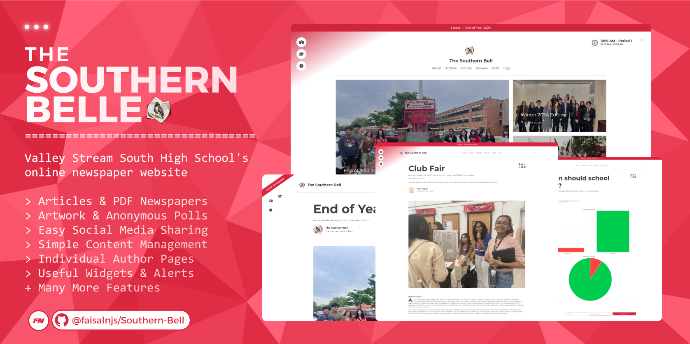

# The Southern Bell

> This project has been taken offline and is no longer maintained.

Valley Stream South High School's online school newspaper website

- Articles & PDF Newspapers
- Artwork & Anonymous Polls
- Easy Social Media Sharing
- Simple Content Management
- Individual Author Pages
- Useful Widgets & Alerts
- Many More Features

## Development

`npm install`
`nodemon index.js --watch index.js`

Nodemon will start a development server at `localhost:3000`

## Production

Files are transferred to the host using the GitHub Action automation workflow at [.github\workflows\prod.yml](https://github.com/faisalnjs/Southern-Bell/tree/prod/.github/workflows/prod.yml).

## CMS

To access the CMS, navigate to the `/admin` path to be redirected to the admin panel.

The CMS is **required** to run this project, and you must provide a valid API key to connect to the CMS server. The private CMS repository can be found at [dangoweb/cms-repository](https://github.com/dangoweb/cms-repository).
